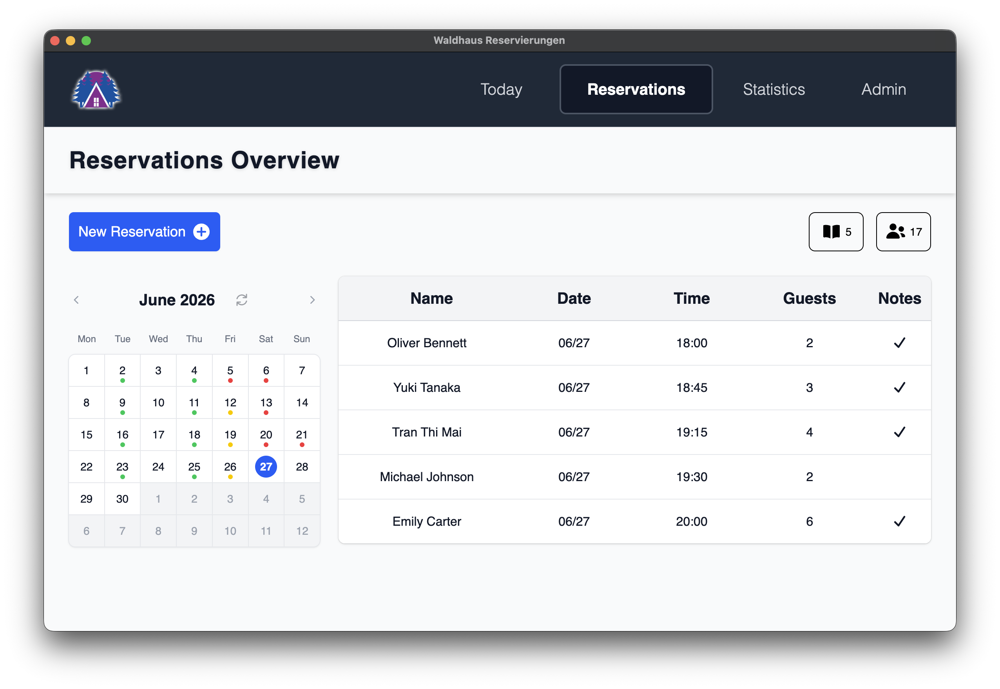

# Waldhaus Reservations

A desktop application for managing restaurant reservations and reviewing booking statistics. Reservations are stored locally in SQLite and surfaced through a calendar-driven interface, a daily agenda, and monthly/yearly charts.



Data lives in `database.sqlite` under Electron's per-user `userData` directory. The renderer talks to the main process over IPC; no external server is required.

## Getting Started

Requires Node.js 18+.

```bash
npm install      # install dependencies
npm start        # run Vite + Electron in development
```

Localization defaults to English; set `lang` in `src/i18n.ts` to `'de'` for German.

## Build & Package

```bash
npm run build    # type-check and bundle the renderer
npm run package  # produce a distributable via electron-builder
```

## Scripts

| Command | Description |
| --- | --- |
| `npm start` | Run the app in development (Vite + Electron). |
| `npm run dev` | Start the Vite dev server only. |
| `npm run build` | Type-check and build the production bundle. |
| `npm run package` | Build and package the desktop app. |
| `npm run lint` | Run ESLint. |
